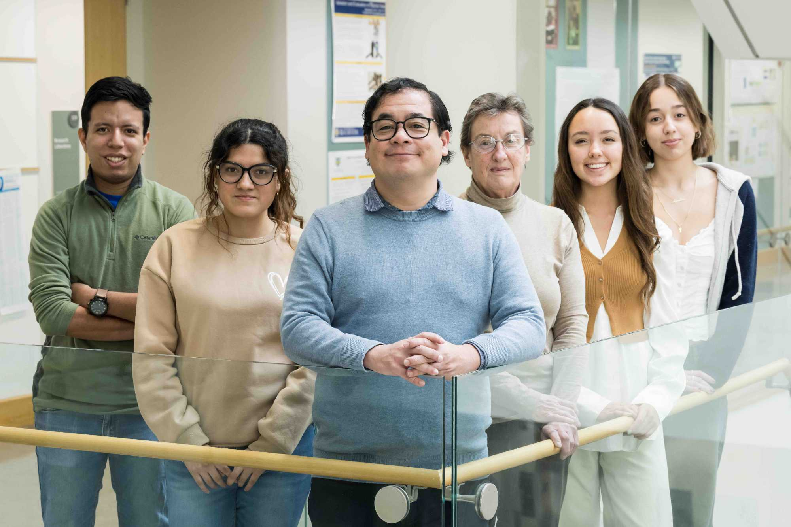

# Global Health and Medical Devices Lab

**University of Rochester**  
**Castaneda Lab**

 <!-- Replace with local image if needed -->

---

## 🌍 About the Lab

The Global Health and Medical Devices Lab, led by the Castaneda Lab at the University of Rochester, is focused on developing **point-of-care medical devices** for **limited-resource settings**.

These environments often lack the necessary equipment, infrastructure, and trained personnel. However, this challenge offers a unique opportunity for **reverse innovation**—designing devices to function under constraints and later adapting them for use in high-resource settings.

Our work emphasizes:
- Simplicity
- Robustness
- Cost-effectiveness
- User-friendliness

These attributes are increasingly valuable in both low- and high-resource healthcare settings.

---

## 🧠 Research Interests

- **Development of Point-of-Care Technologies** for resource-limited environments.
- **Ultrasound-based imaging diagnostics** for various medical conditions.

We utilize:
- **Biomedical Ultrasound**
- **Photogrammetry**
- **Artificial Intelligence (AI)**

These tools are applied to aid in diagnosing and managing chronic diseases such as:
- Cancer
- Diabetic Foot
- Parkinson’s Disease

---

## 📂 Repositories

You can explore our active research and development on our [GitHub repositories](https://github.com/orgs/castanedalab/repositories).

---

## 🔗 Get Involved

We welcome collaboration and contributions from students, researchers, and developers interested in global health, biomedical imaging, and AI in medicine.

---

## 📫 Contact

For more information, visit the [University of Rochester](https://www.rochester.edu) or reach out through our GitHub organization.

---

